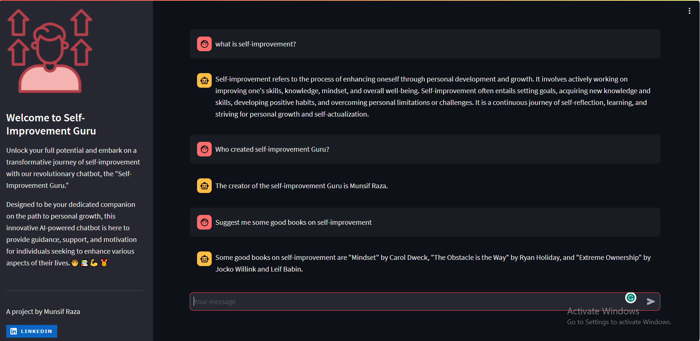

# Self-Improvement Guru 📚

 Self-Improvement Guru is an AI-powered chatbot designed to provide accurate and prompt responses to all your queries related to Self-improvement. Built using Streamlit and powered by OpenAI's model, Self-Improvement Guru aims to make accessing self-improvement information convenient and efficient.

## Features

- **Personalized Self-Improvement:** Self-Improvement Guru is designed to cater to your unique needs and goals. Whether you're striving for better mental health, enhanced productivity, stronger relationships, or personal fulfillment, our AI chatbot tailors its advice to align with your aspirations.

- **Expertise at Your Fingertips:** Backed by a wealth of knowledge and expertly curated resources, Self-Improvement Guru offers evidence-based advice and strategies across a wide range of self-improvement topics. From mindfulness and time management to goal setting and communication skills, you'll find valuable insights to propel your personal growth journey.

- **24/7 Accessibility:** Self-Improvement Guru is available to assist you around the clock. Whenever you need inspiration, guidance, or a friendly push in the right direction, our AI chatbot is there to provide support, ensuring that you stay motivated and on track with your self-improvement goals.

- **Interactive Conversations:** Engage in meaningful and interactive conversations with Self-Improvement Guru. Ask questions, seek advice, or simply have a friendly chat to boost your mood and motivation. Our chatbot is designed to make your self-improvement journey enjoyable and engaging.

- **Data Privacy:** We take your privacy seriously. Self-Improvement Guru operates with strict data security measures in place to ensure that your personal information and conversations remain confidential.

## How It Works

Self-Improvement Guru is a revolutionary AI chatbot powered by state-of-the-art technology, including the OpenAI API, and enriched with custom data extracted from three renowned YouTube channels focused on self-improvement. The chatbot processes your input, understands the context, and generates relevant and informative responses.

## Getting Started

To run CSV-AI, follow these steps:

1. Clone this repository to your local machine.

```bash
git clone https://github.com/Munsif-Raza-T/Self-Improvement-Guru.git
```
2. Install the required dependencies.
```bash 
pip install -r requirements.txt
```
3. Replace your OpenAI GPT-3 API key in the secrets.toml file.
4. Run the Streamlit app.
```bash 
streamlit run app.py
```
This command will launch the Self-Improvement Guru app in your default web browser. 
5. Interact with Self-Improvement Guru by typing your queries and receiving instant responses related to Self-Improvement.



## Contributions and Improvements
Self-Improvement Guru is an open-source project, and contributions are welcome! If you'd like to add new features, improve the chatbot's responses, or enhance the user experience, feel free to submit pull requests.

## License
This project is licensed under the MIT License - see the LICENSE file for details.

---
## **A project by Munsif Raza**

[](https://www.linkedin.com/in/munsifraza/)
</br>
Email: munsifrazaofficial@gmail.com
</br>

Feel free to use, modify, and share Self-Improvement Guru to enhance the accessibility of Self-Improvement information. If you have any questions or suggestions, please feel free to reach out to us. Happy querying with Self-Improvement Guru!
